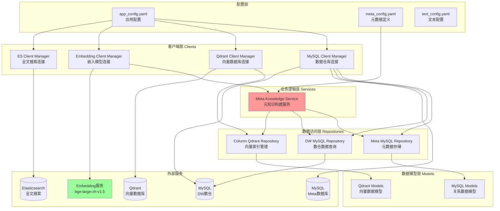
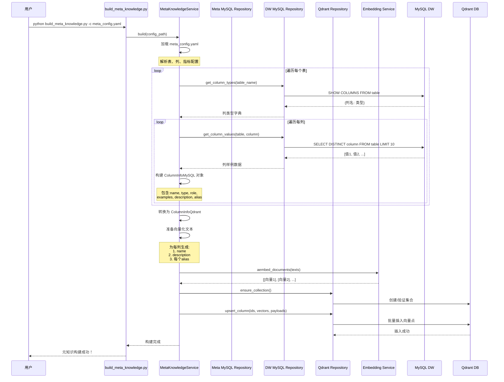
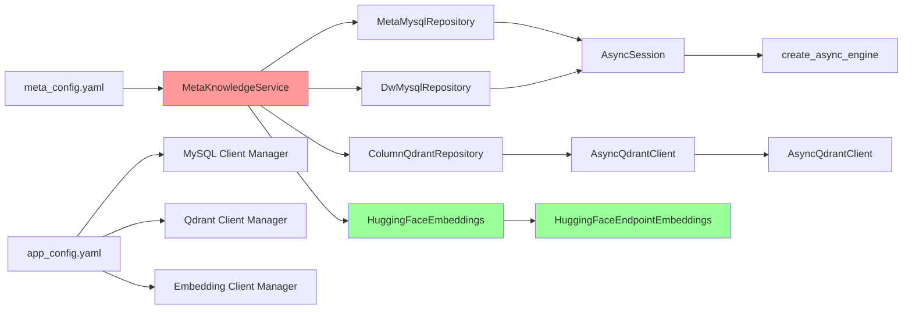
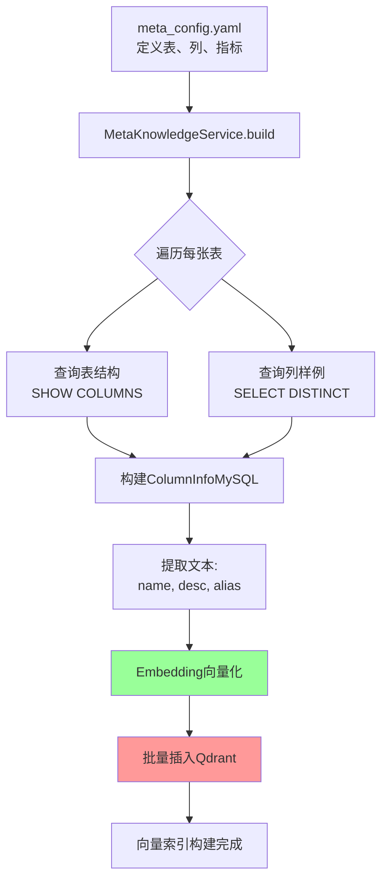

# Data-Agent 项目架构详解

## 📋 项目概述

**Data-Agent** 是一个智能数据仓库元数据管理与语义查询系统。通过向量化技术和 LLM，让用户可以用自然语言查询数据仓库。

### 核心功能
- 🗄️ **元数据管理**：管理数仓的表、列、指标元数据
- 🔍 **语义搜索**：基于向量相似度的智能列推荐
- 🤖 **自然语言查询**：支持中文业务语言查询数据仓库
- 📊 **多维分析**：支持维度表、事实表、指标的智能关联

---

## 🏗️ 系统架构图



---

## 🔄 核心业务流程

### 流程1：元知识构建流程



---

## 📁 目录结构详解

```
data-agent/
├── conf/                          # 配置文件目录
│   ├── app_config.yaml           # 应用配置（数据库、服务地址）
│   ├── meta_config.yaml          # 元数据定义（表、列、指标）
│   └── text_config.yaml          # 文本配置
│
├── app/                          # 应用主目录
│   ├── clients/                  # 客户端管理层
│   │   ├── mysql_client_manager.py      # MySQL连接管理
│   │   ├── qdrant_client_manager.py     # Qdrant连接管理
│   │   ├── embedding_client_manager.py  # Embedding服务管理
│   │   └── es_client_manager.py         # ES连接管理
│   │
│   ├── repositories/             # 数据访问层
│   │   ├── mysql/
│   │   │   ├── meta_mysql_repository.py      # 元数据CRUD
│   │   │   └── dw_mysql_repository.py        # 数仓数据查询
│   │   └── qdrant/
│   │       └── column_qdrant_respository.py  # 向量索引操作
│   │
│   ├── models/                   # 数据模型层
│   │   ├── mysql/
│   │   │   ├── base.py                   # SQLAlchemy基类
│   │   │   ├── table_info_mysql.py       # 表信息模型
│   │   │   ├── column_info_mysql.py      # 列信息模型
│   │   │   ├── metric_info_mysql.py      # 指标信息模型
│   │   │   └── column_metric_mysql.py    # 列-指标关联模型
│   │   └── qdrant/
│   │       └── column_info_qdrant.py     # 向量数据模型
│   │
│   ├── services/                 # 业务逻辑层
│   │   └── meta_knowledge_service.py    # 元知识构建服务
│   │
│   ├── scripts/                  # 脚本工具
│   │   └── build_meta_knowledge.py      # 元知识构建脚本
│   │
│   ├── conf/                     # 配置加载
│   │   ├── app_config.py        # 应用配置类
│   │   └── meta_config.py       # 元数据配置类
│   │
│   └── core/                    # 核心工具
│       ├── context.py           # 上下文管理
│       └── log.py              # 日志配置
│
├── main.py                       # 项目入口（当前为示例）
├── pyproject.toml               # 项目依赖定义
└── uv.lock                      # 依赖锁定文件
```

---

## 🔧 核心模块详解

### 1. 客户端管理层 (Clients)

#### MySQL Client Manager
**文件**: `app/clients/mysql_client_manager.py`

**职责**:
- 管理 MySQL 数据库连接池
- 提供异步 Session 工厂

**核心代码**:
```python
class MysqlClientManager:
    def init(self):
        self.engine = create_async_engine(
            url=f"mysql+asyncmy://{user}:{password}@{host}:{port}/{db}",
            pool_size=5,
            pool_pre_ping=True  # 自动检测连接有效性
        )
        self.session_factory = async_sessionmaker(
            bind=self.engine,
            autoflush=True,
            autobegin=True,
            expire_on_commit=False
        )
```

**依赖参数**:
- `host`, `port`, `user`, `password`, `database`

#### Qdrant Client Manager
**文件**: `app/clients/qdrant_client_manager.py`

**职责**:
- 管理 Qdrant 向量数据库连接

**核心方法**:
```python
client = AsyncQdrantClient(url="http://localhost:6333")
```

#### Embedding Client Manager
**文件**: `app/clients/embedding_client_manager.py`

**职责**:
- 连接 HuggingFace Embedding 服务
- 提供文本向量化能力

**使用模型**: `BAAI/bge-large-zh-v1.5`
- 向量维度: 1024
- 支持中文语义理解

**方法**:
```python
embeddings.aembed_query(text)      # 单个文本 → [float]
embeddings.aembed_documents([texts])  # 批量文本 → [[float], [float], ...]
```

---

### 2. 数据访问层 (Repositories)

#### DW MySQL Repository
**文件**: `app/repositories/mysql/dw_mysql_repository.py`

**职责**:
- 查询数据仓库的表结构
- 获取列的实际数据样例

**核心方法**:

1. **获取列类型**
```python
async def get_column_types(table_name: str) -> dict[str, str]:
    # SQL: SHOW COLUMNS FROM {table_name}
    # 返回: {"column_name": "varchar(255)", ...}
```

2. **获取列数据样例**
```python
async def get_column_values(table_name, column_name, limit=10) -> list[str]:
    # SQL: SELECT DISTINCT {column_name} FROM {table_name} LIMIT {limit}
    # 返回: ["值1", "值2", "值3", ...]
```

#### Column Qdrant Repository
**文件**: `app/repositories/qdrant/column_qdrant_respository.py`

**职责**:
- 管理 Qdrant 集合
- 向量数据的增删改查

**核心操作**:
```python
# 1. 确保集合存在
await client.create_collection(
    collection_name="column_info",
    vectors_config=VectorParams(size=1024, distance=Distance.COSINE)
)

# 2. 批量插入向量
await client.upsert(
    collection_name="column_info",
    points=[
        PointStruct(
            id=uuid,
            vector=[0.1, 0.2, ...],  # 1024维向量
            payload={...}            # 列元数据
        )
    ]
)

# 3. 向量相似度搜索
results = await client.query_points(
    collection_name="column_info",
    query=query_vector,
    limit=5,
    score_threshold=0.7
)
```

---

### 3. 业务逻辑层 (Services)

#### Meta Knowledge Service
**文件**: `app/services/meta_knowledge_service.py`

**核心方法**: `build(config_path)`

**完整流程**:

```python
async def build(self, config_path: Path):
    # ========== 第1步：加载配置 ==========
    context = OmegaConf.load(config_path)
    meta_config: MetaConfig = OmegaConf.to_object(context)

    # ========== 第2步：处理表信息 ==========
    column_infos = await self._save_table_info_to_meta_db(meta_config)

    # 第2.1步：查询DW数仓，获取列的实际数据
    for table in meta_config.tables:
        # 获取列类型
        column_types = await dw_repo.get_column_types(table.name)

        # 获取列数据样例
        for column in table.columns:
            values = await dw_repo.get_column_values(table.name, column.name)

            # 构建 ColumnInfoMySQL 对象
            column_info = ColumnInfoMySQL(
                id=f"{table.name}.{column.name}",
                name=column.name,
                type=column_types[column.name],
                role=column.role,
                examples=values,  # 实际数据样例
                description=column.description,
                alias=column.alias
            )

    # 第2.2步：向量化列信息
    await self._save_column_info_to_qdrant(column_infos)

    # ========== 第3步：处理指标信息 ==========
    # TODO: 未来实现
```

**向量化详解**:

对每个列，生成多个向量点：
1. **列名向量**: `region_name` → [0.12, 0.34, ...]
2. **描述向量**: `订单所属的大区名称` → [0.56, 0.78, ...]
3. **别名向量**: 每个别名生成一个向量
   - `地区` → [0.23, 0.45, ...]
   - `区域` → [0.67, 0.89, ...]
   - `大区` → [0.12, 0.98, ...]

**为什么这么做？**
- 用户可能用不同的词查询："地区"、"区域"、"大区"
- 通过多角度向量化，提高召回率

---

## 🗄️ 数据模型详解

### MySQL 数据模型

#### ColumnInfoMySQL
**文件**: `app/models/mysql/column_info_mysql.py`

| 字段 | 类型 | 说明 | 示例 |
|------|------|------|------|
| id | String(64) | 主键 | `fact_order.order_amount` |
| name | String(128) | 列名 | `order_amount` |
| type | String(64) | 数据类型 | `decimal(10,2)` |
| role | String(32) | 列角色 | `measure` |
| examples | JSON | 数据样例 | `["100.00", "256.50", ...]` |
| description | Text | 列描述 | `订单金额` |
| alias | JSON | 别名列表 | `["销售额", "订单金额", "收入"]` |
| table_id | String(64) | 所属表 | `fact_order` |

#### TableInfoMySQL
**文件**: `app/models/mysql/table_info_mysql.py`

| 字段 | 类型 | 说明 |
|------|------|------|
| id | String(64) | 表名 |
| name | String(128) | 表名 |
| role | String(32) | dim/fact |
| description | Text | 表描述 |

### Qdrant 数据模型

#### ColumnInfoQdrant
**文件**: `app/models/qdrant/column_info_qdrant.py`

```python
class ColumnInfoQdrant:
    id: str              # fact_order.order_amount
    name: str            # order_amount
    type: str            # decimal(10,2)
    role: str            # measure
    examples: list[str] # 实际数据样例
    alias: list[str]     # 别名
    description: str     # 描述
    table_id: str        # fact_order
```

**存储结构**:
```
Qdrant Point:
{
  "id": "uuid-1",
  "vector": [0.12, 0.34, ..., 0.56],  # 1024维
  "payload": {
    "text": "订单金额",  # 用于向量化
    "column_info": ColumnInfoQdrant对象
  }
}
```

---

## 🎯 典型使用场景

### 场景1：构建元知识库

**命令**:
```bash
uv run python app/scripts/build_meta_knowledge.py -c conf/meta_config.yaml
```

**执行流程**:
1. 读取 `meta_config.yaml` 中定义的5张表
2. 连接 MySQL DW 数仓，查询每列的实际数据
3. 调用 Embedding 服务，生成约 **150个向量点**
   - 5张表 × 5列 × 3个文本 (name+desc+2个alias平均)
4. 存储到 Qdrant 向量数据库

### 场景2：语义搜索列（未来功能）

**用户查询**: "我想看销售额"

**系统处理**:
```python
# 1. 向量化查询文本
query_vector = await embeddings.aembed_query("销售额")

# 2. Qdrant相似度搜索
results = await qdrant_client.query_points(
    collection_name="column_info",
    query=query_vector,
    limit=5
)

# 3. 返回最相关的列
# results[0].payload = ColumnInfoQdrant(
#     name="order_amount",
#     table="fact_order",
#     description="订单金额",
#     alias=["销售额", "订单金额", "收入"]
# )
```

---

## 🔗 依赖关系图谱



---

## 📊 数据流转图



---

## 🎨 配置文件详解

### app_config.yaml

```yaml
# 日志配置
logging:
  file:
    enable: true
    level: INFO
    path: logs
    rotation: "10 MB"
    retention: "7 days"

# Meta数据库配置
db_meta:
  host: localhost
  port: 3306
  user: atguigu
  password: Atguigu.123
  database: meta

# DW数仓配置
db_dw:
  host: localhost
  port: 3306
  user: atguigu
  password: Atguigu.123
  database: dw

# Qdrant向量数据库
qdrant:
  host: localhost
  port: 6333
  embedding_size: 1024  # 向量维度

# Embedding服务
embedding:
  host: localhost
  port: 8081
  model: BAAI/bge-large-zh-v1.5

# Elasticsearch全文搜索
es:
  host: localhost
  port: 9200
  index_name: data_agent

# LLM配置
llm:
  model_name: deepseek-chat
  api_key: <deepseek_api_key>
```

### meta_config.yaml

```yaml
tables:
  - name: dim_region
    role: dim  # 维度表
    description: 地区维度表
    columns:
      - name: region_id
        role: primary_key
        description: 地区唯一标识
        alias: [地区ID, 区域ID]
        sync: false  # 是否同步到ES

      - name: region_name
        role: dimension  # 维度属性
        description: 订单所属的大区名称
        alias: [地区, 区域, 大区]
        sync: true

  - name: fact_order
    role: fact  # 事实表
    description: 订单事实表
    columns:
      - name: order_amount
        role: measure  # 度量
        description: 订单金额
        alias: [销售额, 订单金额, 收入]

metrics:
  - name: GMV
    description: 成交总额
    relevant_columns:
      - fact_order.order_amount
    alias: [成交总额, 订单总额]
```

---

## 🚀 快速开始

### 1. 启动依赖服务

```bash
# MySQL
docker run -d --name mysql -p 3306:3306 \
  -e MYSQL_ROOT_PASSWORD=root mysql:8.0

# Qdrant
docker run -d --name qdrant -p 6333:6333 qdrant/qdrant

# Embedding服务
docker run -d --name embedding -p 8081:80 \
  volume:/model \
  --gpus all \
  teijaka/paragraph-embedding:latest
```

### 2. 构建元知识

```bash
# 安装依赖
uv sync

# 构建元知识库
uv run python app/scripts/build_meta_knowledge.py -c conf/meta_config.yaml
```

### 3. 验证

```bash
# 查看Qdrant中的向量点
curl http://localhost:6333/collections/column_info
```

---

## 📝 依赖库说明

| 库名 | 版本 | 用途 |
|------|------|------|
| asyncmy | 0.2.11 | MySQL异步驱动 |
| fastapi | 0.128.0 | Web框架 |
| langchain | 1.2.7 | LLM应用框架 |
| langchain-huggingface | 1.2.1 | HuggingFace集成 |
| qdrant-client | 1.16.2 | Qdrant向量数据库客户端 |
| elasticsearch | 8.x | 全文搜索 |
| sqlalchemy | 2.0.46 | ORM |
| loguru | 0.7.3 | 日志 |
| omegaconf | 2.3.0 | 配置管理 |

---

## 🎯 项目亮点

1. **异步架构**: 全异步设计，高并发性能
2. **分层清晰**: Client → Repository → Service → Script
3. **向量化搜索**: 支持中文语义理解
4. **多角度索引**: name + description + alias 多向量
5. **可扩展**: 易于添加新的数据源和搜索方式

---

## 📌 后续扩展方向

- [ ] 指标的向量化和搜索
- [ ] 基于LangChain的自然语言查询接口
- [ ] 列值分布的全文索引（Elasticsearch）
- [ ] Web API接口（FastAPI）
- [ ] 查询历史记录和推荐
- [ ] 数据血缘分析

---

## 🤔 常见问题

**Q1: 为什么一个列生成多个向量点？**
A: 提高召回率。用户可能用"销售额"、"订单金额"、"收入"等不同词查询，多角度索引能覆盖更多查询场景。

**Q2: 向量维度为什么是1024？**
A: 由 `bge-large-zh-v1.5` 模型决定，这是它的输出维度。

**Q3: 为什么使用异步？**
A: 向量化、数据库查询都是IO密集型操作，异步可以大幅提升性能。

---

*生成时间: 2026-06-21*
